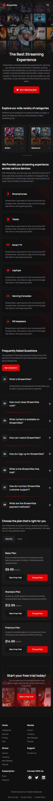

# StreamVibe

StreamVibe is a responsive streaming platform web-site built with Minista and React, using HTML5, SCSS, and JavaScript for scalable, maintainable code. 
It features interactive Swiper components, IMask form inputs, and a fully responsive layout with CSS variables, Flexbox, and Grid.

## 🚀 Demo
https://developer-online.com/portfolio/stream-vibe/

## ✨ Features
- Fully responsive layout for desktop, tablet, and mobile
- Interactive UI components (sliders, tabs, accordions)
- Modern, content-focused design
- Semantic and accessible HTML structure
- Smooth UX and well-structured styles

## 🛠 Tech Stack
- Minista + React — static site generator and UI library
- HTML5
- SCSS — type safety and scalable styling
- Swiper — sliders and carousels
- IMask — input masking for forms
- CSS variables and flexible grid system for responsive layouts
- JavaScript  - UI logic and interactions
- Responsive layout techniques (Flexbox, Grid)

## 📷 Screenshots

### Desktop

### Mobile

## 📌 Project Purpose
This project was created as a portfolio showcase to demonstrate:
- Responsive layout implementation
- Interactive UI without heavy frameworks
- Clean and maintainable front-end code
- Attention to UI/UX and visual hierarchy

---

Made as a front-end portfolio project.
